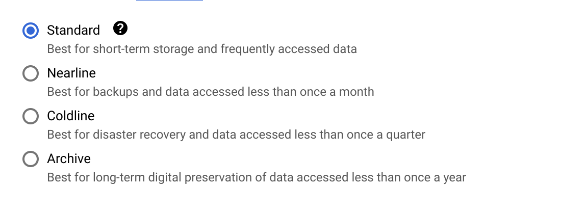

# _CREA Technical Assignment_
-  [Assignment Description](https://energyandcleanair.notion.site/Technical-Assignment-Software-Engineer-314bdd68862b400d90f76ed445be46bd)
 
## Task 1: Help Rosa store files for her experiments

**Objective**: Find a **low-cost** storage solution to help rosa store hundereds of GiBs of python generated files **easily** 

#### Solution 1: [Cloud Firestore](https://firebase.google.com/docs/firestore/)
- Pros
    - Firestore is serverless, so you are only charged for total reads and writes performed. This makes it [low cost](https://cloud.google.com/firestore/pricing). 
    - Firebase has a [python client](https://firebase.google.com/docs/reference/admin/python/), therefore the file uploading can be automated using python. 
    - The documentation is clear and concise.
- Cons
    - Requires you to store data in a specific JSON like structure.

#### Solution 2: [GCP Buckets](https://cloud.google.com/storage/docs/buckets)

- Pros
    - [Low Cost](https://cloud.google.com/storage/pricing#regions) 
    - Buckets offer different storage classes, depending on frequency of reads and writes
    - GCP has [python client](https://github.com/googleapis/google-cloud-python#google-cloud-python-client), therefore the file uploading can be automated using python. 
- Cons
    - Cannot have nested buckets
---
## Task 2: Collect Ozone mass mixing ratio at 850hPa

#### Requirements
- [Python3](https://www.python.org/downloads/)
- Copernicus UID and API KEY
	- Ensure that your Copernicus UID and API KEY are stored in  ~/.cdsapirc
	```bash
	cat ~/.cdsapirc
	url: https://cds.climate.copernicus.eu/api/v2
	key: <UID>:<API key>
	verify: 0
	```
#### Setup 
- Navigate to __task2__ directory
```bash
cd task2
```
-  create virtualenv crea_env
```bash
virtualenv crea_env
```
- Activate virtual environment
```bash
$ source crea_env/bin/activate
```
- Install Requirements 
```bash
pip install -r requirements.txt 
```
#### Build ozone_mass_mixing_ratio global raster

- The python file __get_O3_mass_mixing.py__ allows you to build a global raster via cli

```bash
$ python get_O3_mass_mixing.py -h

usage: get_O3_mass_mixing.py [-h] d

Build global raster (geotiff) of average Ozone mass mixing ratio at 850hPa of any given day

positional arguments:
  d           Date in format dd/mm/yyyy

options:
  -h, --help  show this help message and exit

```

- To to build global raster (geotiff) of average Ozone mass mixing ratio at 850hPa of any given day run
```bash
python get_O3_mass_mixing.py dd/mm/yyyy 
```
- Example: For 12th Jan 2020, run
```bash
python get_O3_mass_mixing.py 12/01/2020 
```
- A geotiff file '__out.tiff__' will be produced alongside a png file '__out.png__'  in the task2 diretory
```bash
ls
crea_env  download.nc  get_O3_mass_mixing.py  out.png  out.tiff  requirements.txt
```
---
## Task 3 [Option B]: Create a new trajectory dashboard

#### Requirements 
- [Node.js](https://nodejs.org/en)

#### Setup 

- Navigate to trajectories dashboard
```bash
cd trajectories-dashboard
```
- Install dependencies
```bash
npm install
```
#### Compile and Hot-Reload for Development

- In trajectories-dashboard, execute
```bash
npm run  dev
```
-  Point your browser to http://localhost:8081. You should see the following dashboard


- Please select City and Date from the dropdown menus. 
 
- If air trajectories for the chosen city on the chosen date are not available. You will see a 'Data not available' message. 

- If air trajectories are available, then you can see them as blue lines on the map. 
